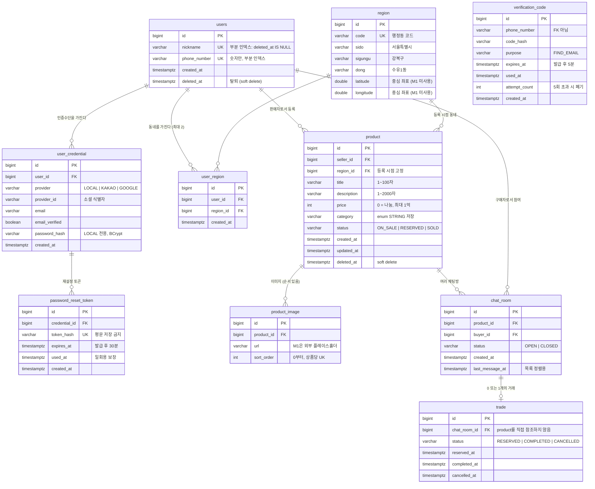
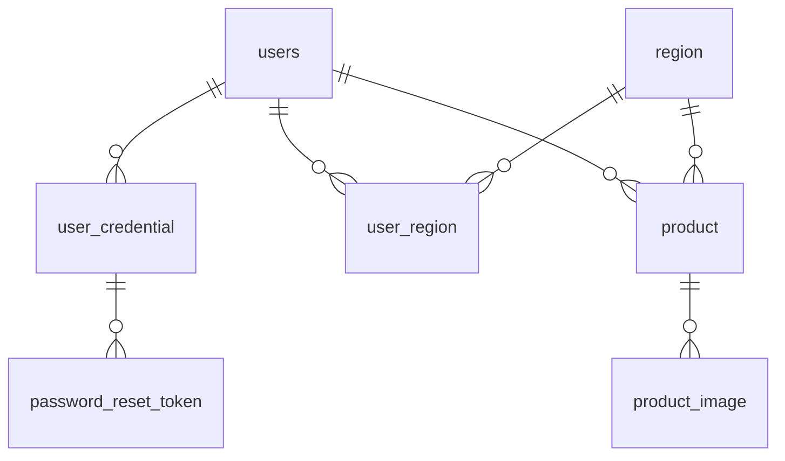

# ERD

> 엔티티 정의와 설계 근거는 [domain.md](./domain.md)에 있다. 이 문서는 **관계의 시각화**만 담당한다.
> 필드나 관계가 바뀌면 domain.md와 이 문서를 함께 갱신한다.

---

## 전체 ERD

> `verification_code`는 휴대폰 번호를 키로 쓰고 `users`를 참조하지 않아서 관계선이 없다.
> 가입 전 사용자에게도 발급될 수 있어야 하기 때문이다.

---

## M1 범위

`verification_code`도 M1에 포함된다(관계가 없어 위 그림에서 생략).
`chat_room`과 `trade`는 **설계만 하고 테이블을 만들지 않는다.**

---

## 이 ERD에서 눈여겨볼 지점

### 1. `product`가 `region`을 직접 참조한다

`users → region`을 따라가지 않는다. 상품은 **등록 시점의 동네에 고정**되어야 하기 때문이다.
판매자가 이사해서 동네를 바꿔도 이미 올린 상품은 원래 동네에 남는다.

### 2. `trade`가 `product`를 직접 참조하지 않는다

`trade → chat_room → product` 경로로만 상품에 닿는다.
예약은 항상 채팅방 안에서 시작되므로, **채팅방 없는 거래를 구조적으로 만들 수 없게** 한 것이다.

대가로 "상품당 활성 거래는 하나"라는 제약을 DB 유니크 인덱스로 바로 걸 수 없다.
이 문제는 의도적으로 연기했다 → [domain.md](./domain.md#의도적-연기-동시-예약-경합)

### 3. 인증 정보가 `users`에 없다

이메일과 비밀번호가 `user_credential`에 있다.
소셜 로그인을 나중에 추가해도 `users`에 null 컬럼이 늘어나지 않고,
비밀번호 재설정을 **검증된 LOCAL 이메일로만** 제한할 수 있다.

### 4. soft delete가 unique 제약과 얽힌다

`users.nickname`과 `users.phone_number`는 단순 unique가 아니라
`WHERE deleted_at IS NULL` 부분 인덱스다. 그러지 않으면 탈퇴해도 닉네임이 영구 점유된다.

---

## 주요 인덱스

| 대상 | 인덱스 | 목적 |
|---|---|---|
| product | `(region_id, status, deleted_at, created_at DESC)` | 동네별 목록 조회. **성능 실험의 주인공** |
| users | `UNIQUE (nickname) WHERE deleted_at IS NULL` | 살아있는 사용자끼리만 유일 |
| users | `UNIQUE (phone_number) WHERE deleted_at IS NULL` | 아이디 찾기 입력값 |
| user_credential | `UNIQUE (provider, provider_id)` | 같은 소셜 계정 중복 가입 방지 |
| user_credential | `UNIQUE (provider, email) WHERE provider = 'LOCAL'` | 이메일 중복 가입 방지 |
| user_region | `UNIQUE (user_id, region_id)` | 같은 동네 중복 등록 방지 |
| product_image | `UNIQUE (product_id, sort_order)` | 이미지 순서 충돌 방지 |
| chat_room | `UNIQUE (product_id, buyer_id)` | 같은 상품+구매자는 채팅방 하나 |
| password_reset_token | `UNIQUE (token_hash)` | |

**`product` 인덱스에 대하여**: mock 20만 건을 넣고 인덱스 없이 목록 조회 시간을 먼저 측정한 뒤,
인덱스를 생성해 재측정한다. 결과는 `docs/measurements/`에 before/after로 기록한다.

컬럼 순서가 중요하다. 등호 비교(`region_id`, `status`, `deleted_at`)가 앞에 오고
정렬 기준(`created_at`)이 뒤에 와야 인덱스를 온전히 탄다.

